# Sieg Gestão Escolar

---

## Sobre o Projeto
O **Sieg Gestão Escolar** é um sistema completo de gestão escolar, desenvolvido como parte do **Projeto Integrador do curso Técnico em Informática**.  
Permite gerenciar **professores, alunos e cursos**, oferecendo cadastro, edição, exclusão, vinculação e filtros avançados.  

O sistema possui **backend em C# / .NET usando Dapper** e **frontend em React**, seguindo boas práticas, validações e autenticação de rotas.

---

## Objetivos
- Gerenciar informações escolares de forma simples e organizada.  
- Implementar **CRUD completo** para professores, alunos e cursos.  
- Garantir que apenas entidades **ativas** possam ser vinculadas.  
- Disponibilizar **filtros avançados de pesquisa** (case-insensitive).  
- Criar interface **intuitiva e responsiva**.

---

## Tecnologias e Ferramentas

**Backend:**  
  
  
  

**Frontend:**  
  
  

**Ferramentas de Projeto:**  
  
  
  

---

## Estrutura do Sistema

### Arquitetura de Pastas

  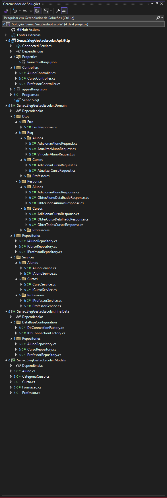
  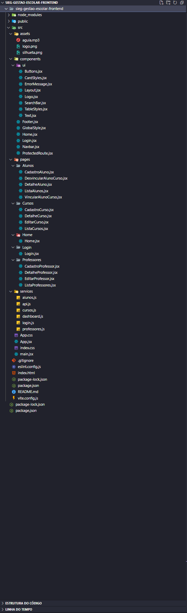

---

## Funcionalidades
- 🔐 Login com autenticação e proteção de rotas  
- 📝 CRUD completo de **Professores, Alunos e Cursos**  
- 🔗 Vinculação de professores e alunos a cursos ativos  
- 🔍 Filtros avançados de pesquisa (case-insensitive)  
- ✅ Validações de campos obrigatórios e e-mails  

---

## Capturas de Tela

### 🔹 Nav Bar e Footer

  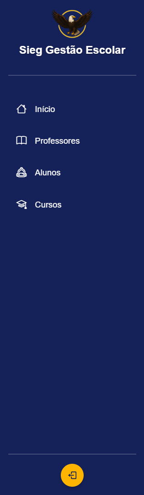
  

---

### 🔹 Login e Painel de Controle

  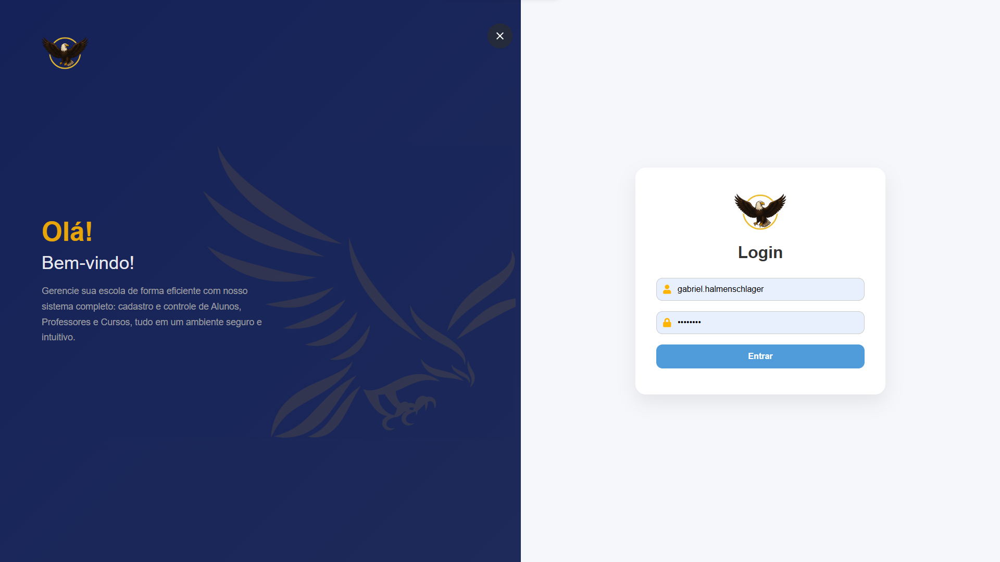
  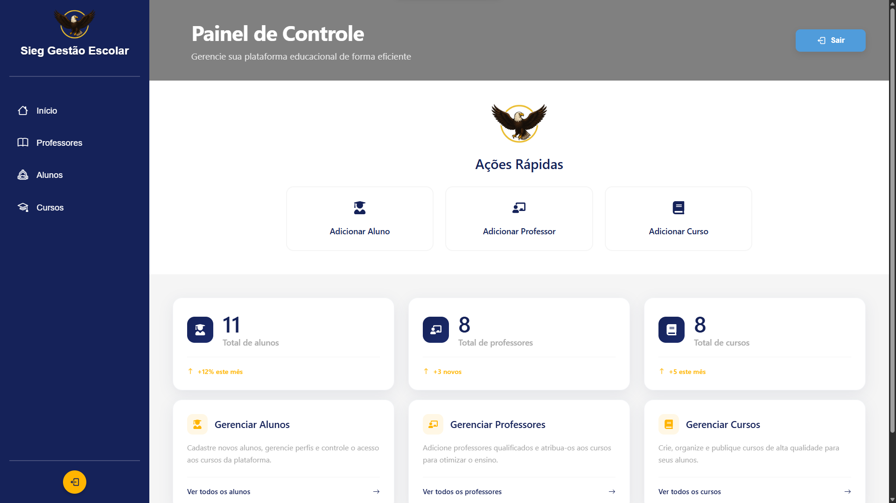

---

### 🔹 Módulo Alunos

  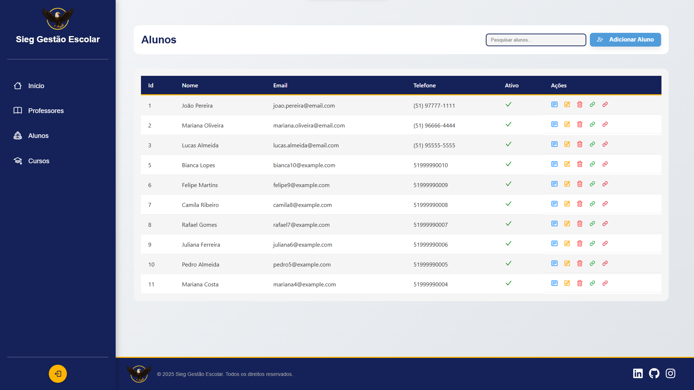
  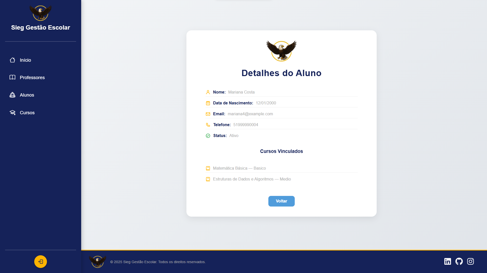
  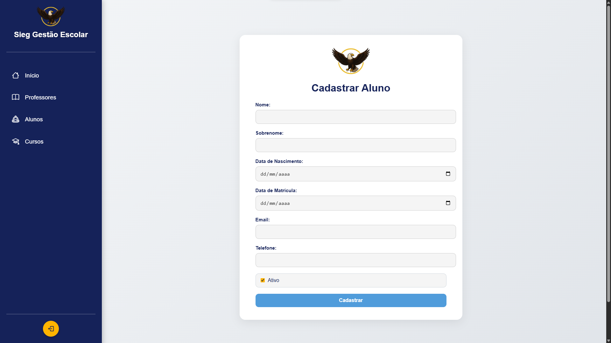

  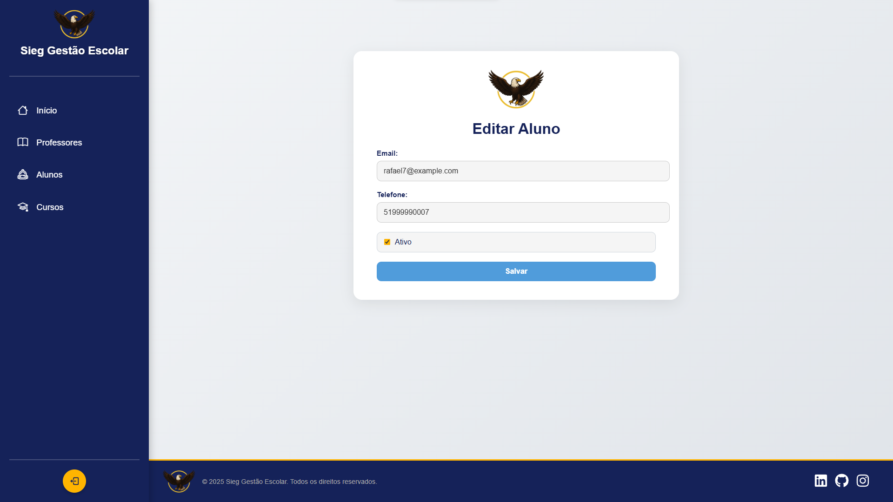
  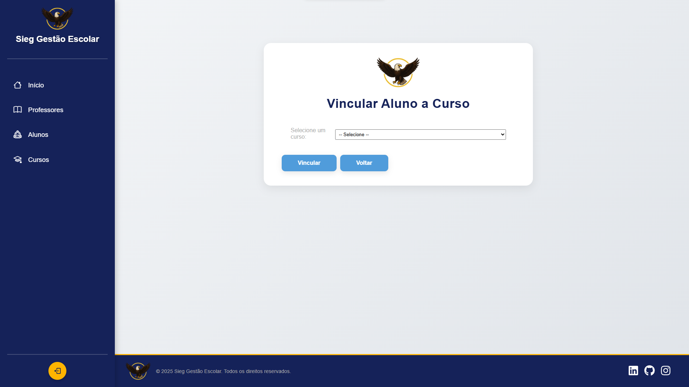
  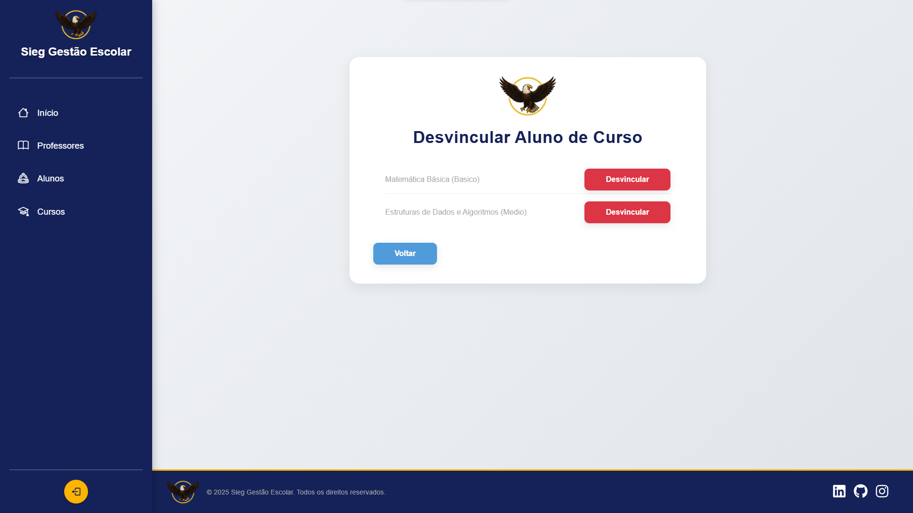

---

### 🔹 Módulo Professores

  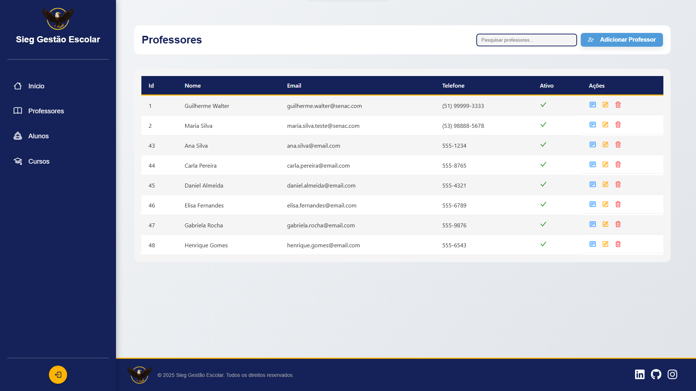
  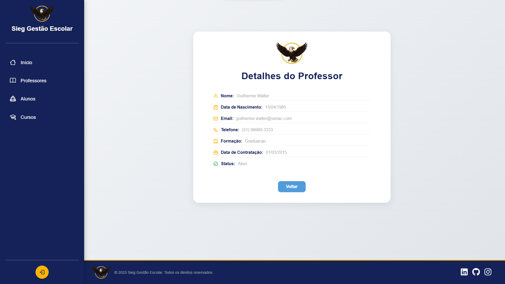
  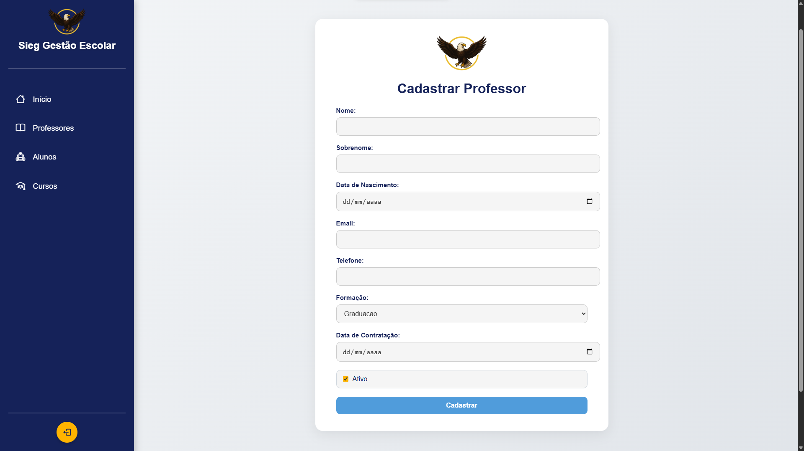
  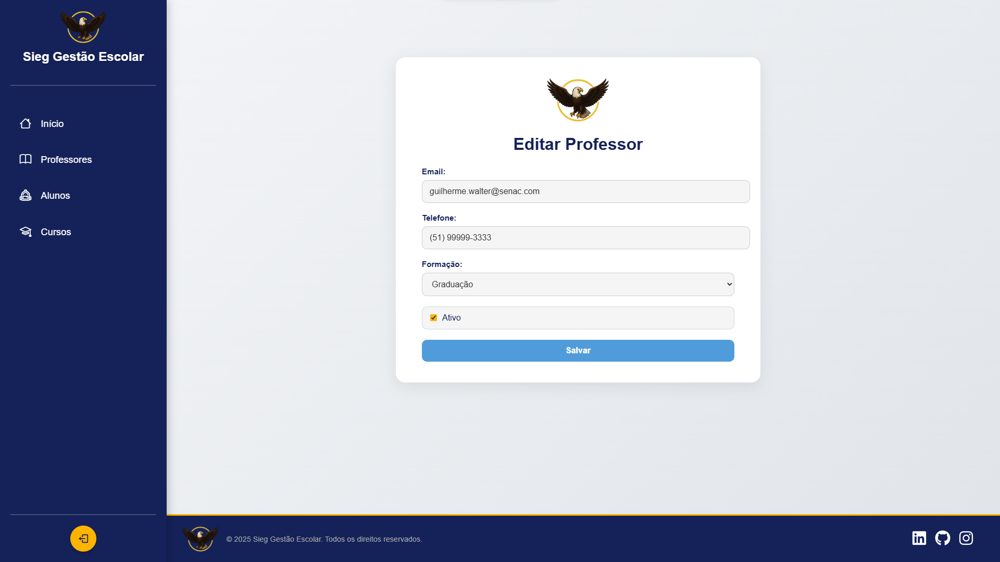

---

### 🔹 Módulo Cursos

  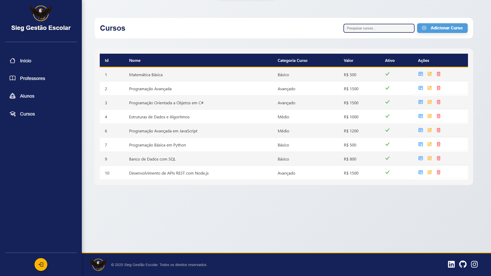
  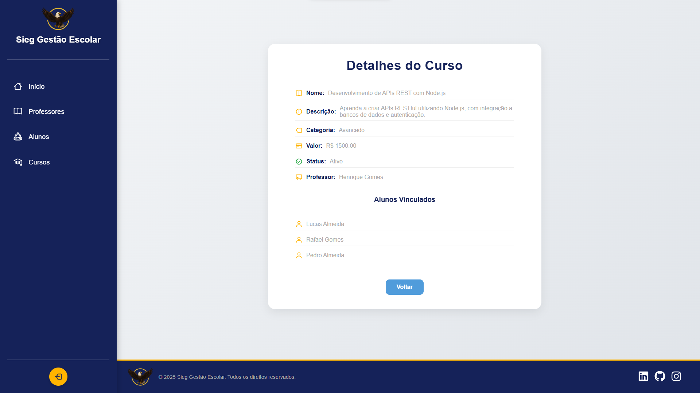
  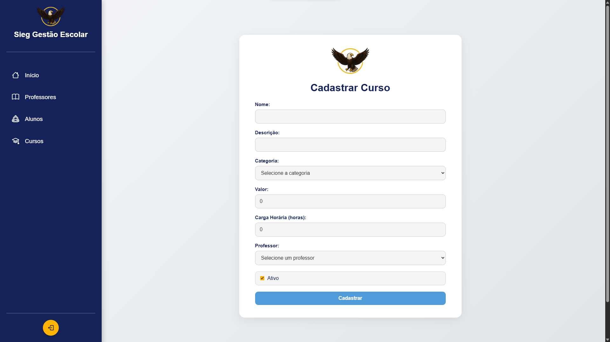
  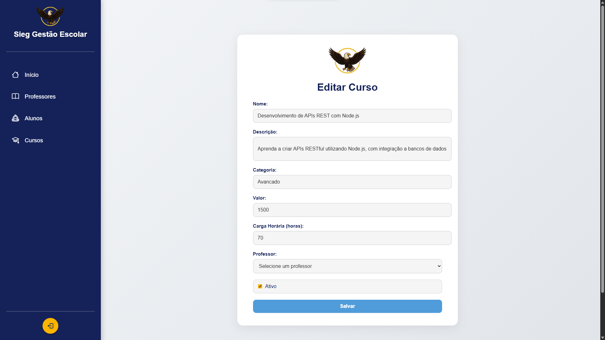

---

## Equipe
- Gabriel Halmenschlager Spall  
- Pedro Henrique Konradt  
- Everton Luiz Henrich Schneiders  
